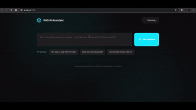

# RAG-Based AI Assistant

A Retrieval-Augmented Generation (RAG) system that creates an intelligent Q&A assistant from your YouTube video collection. The system downloads videos, transcribes them, creates vector embeddings, and enables semantic search to answer questions about video content with precise timestamps.

## 🎥 Demo

See the RAG-Based AI Assistant in action:



---

## 🎯 Overview

This project implements a complete RAG pipeline that:
- Downloads YouTube videos from a list of URLs
- Extracts and converts audio from videos
- Transcribes audio with timestamps using OpenAI's Whisper
- Generates vector embeddings for semantic search
- Answers user questions using local LLMs with relevant video timestamps

## ⚡ Quick Start

```bash
# 1. Create virtual environment with Python 3.12
python -m venv torch_env
torch_env\Scripts\activate  # Windows
# source torch_env/bin/activate  # Linux/macOS

# 2. Install PyTorch with CUDA (for GPU acceleration)
pip install torch torchvision torchaudio --index-url https://download.pytorch.org/whl/cu118

# 3. Install dependencies
pip install openai-whisper yt-dlp pandas numpy scikit-learn joblib requests flask

# 4. Install and configure Ollama
# Download from: https://ollama.ai/
ollama pull bge-m3
ollama pull llama3.2

# 5. Run the pipeline (Terminal/CLI)
python youtube_downloader.py  # Download videos
python video_to_mp3.py        # Extract audio
python mp3_to_json.py         # Transcribe with Whisper
python preprocess_json.py     # Generate embeddings
python process_incoming.py    # Query your data (CLI)

# OR use the Web UI (Recommended!)
python run.py                 # Start web server
# Then open http://localhost:5000 in your browser
```

## 🛠️ Technologies & Tools Used

### Core Libraries
- **[yt-dlp](https://github.com/yt-dlp/yt-dlp)** - YouTube video downloader
- **[FFmpeg](https://ffmpeg.org/)** - Video/audio processing and conversion
- **[OpenAI Whisper](https://github.com/openai/whisper)** - Speech-to-text transcription
- **[Ollama](https://ollama.ai/)** - Local LLM inference server
- **[Flask](https://flask.palletsprojects.com/)** - Web framework for UI

### AI Models
- **Whisper Large-v2** - Audio transcription with multilingual support
- **BGE-M3** - Text embedding model for semantic search (via Ollama)
- **Llama 3.2** - Language model for question answering (via Ollama)

### Data Processing
- **pandas** - Data manipulation and DataFrame operations
- **numpy** - Numerical computing
- **scikit-learn** - Cosine similarity calculations
- **joblib** - Model serialization
- **PyTorch** - Deep learning framework (for Whisper GPU acceleration)

## 🐍 Python Environment Setup

### Recommended: Python 3.12 with Virtual Environment

For optimal performance, especially if you want to leverage GPU acceleration via CUDA for faster Whisper transcription, use Python 3.12 in a dedicated virtual environment.

### Step-by-Step Environment Setup

#### 1. Verify Python Version
```bash
python --version
# Should show: Python 3.12.x
```

If you don't have Python 3.12, download it from [python.org](https://www.python.org/downloads/)

#### 2. Create Virtual Environment

**Windows:**
```bash
# Navigate to project directory
cd "C:\Users\YourUsername\Documents\Python Projects\rag_based_ai"

# Create virtual environment named 'torch_env'
python -m venv torch_env

# Activate the environment
torch_env\Scripts\activate
```

**Linux/macOS:**
```bash
# Navigate to project directory
cd ~/Documents/Python\ Projects/rag_based_ai

# Create virtual environment
python3.12 -m venv torch_env

# Activate the environment
source torch_env/bin/activate
```

#### 3. Install PyTorch with CUDA Support (for GPU)

If you have an NVIDIA GPU and want significantly faster transcription:

```bash
# For CUDA 11.8 (check your CUDA version with: nvidia-smi)
pip install torch torchvision torchaudio --index-url https://download.pytorch.org/whl/cu118

# For CUDA 12.1
pip install torch torchvision torchaudio --index-url https://download.pytorch.org/whl/cu121

# For CPU only (no GPU)
pip install torch torchvision torchaudio
```

**Verify GPU Support:**
```python
import torch
print(f"PyTorch version: {torch.__version__}")
print(f"CUDA available: {torch.cuda.is_available()}")
print(f"CUDA version: {torch.version.cuda}")
```

#### 4. Install Project Dependencies

```bash
# Ensure torch_env is activated
pip install openai-whisper yt-dlp pandas numpy scikit-learn joblib requests flask
```

**Optional: Create requirements.txt for reproducibility**
```bash
# After installing all packages, freeze dependencies
pip freeze > requirements.txt

# Later, install from requirements.txt
pip install -r requirements.txt
```

**Sample requirements.txt:**
```text
openai-whisper
yt-dlp
pandas
numpy
scikit-learn
joblib
requests
flask
torch
torchvision
torchaudio
```

### Why Use Virtual Environment?

✅ **Isolation**: Keeps dependencies separate from system Python  
✅ **Reproducibility**: Easy to replicate the exact environment  
✅ **GPU Support**: PyTorch with CUDA requires specific versions  
✅ **No Conflicts**: Prevents package version conflicts  

### GPU vs CPU Performance

| Hardware | Model | Transcription Speed (1 hour video) |
|----------|-------|-----------------------------------|
| GPU (CUDA) | large-v2 | ~10-15 minutes |
| CPU | large-v2 | ~60-90 minutes |
| GPU (CUDA) | medium | ~5-8 minutes |
| CPU | medium | ~30-45 minutes |

**Note:** GPU acceleration provides 5-6x speed improvement for Whisper transcription!

### Activating Environment for Future Sessions

Every time you work on this project:

```bash
# Windows
torch_env\Scripts\activate

# Linux/macOS
source torch_env/bin/activate
```

You'll see `(torch_env)` prefix in your terminal when active.

### Deactivating Environment

```bash
deactivate
```

## 📋 Prerequisites

> **⚠️ Important:** Complete the [Python Environment Setup](#-python-environment-setup) section above before proceeding with these prerequisites!

### 1. Install FFmpeg
- **Windows**: Download from [ffmpeg.org](https://ffmpeg.org/download.html) and add to PATH
- **Linux**: `sudo apt install ffmpeg`
- **macOS**: `brew install ffmpeg`

### 2. Python Environment
Ensure you have:
- ✅ Python 3.12 installed
- ✅ Virtual environment `torch_env` created and activated
- ✅ PyTorch with CUDA support (if using GPU)
- ✅ All dependencies installed (see [environment setup](#-python-environment-setup))

### 3. Install Ollama
- Download and install from [ollama.ai](https://ollama.ai/)
- Pull required models:
```bash
ollama pull bge-m3      # Embedding model
ollama pull llama3.2    # LLM for inference
```

### 4. Verify Ollama is Running
```bash
# Start Ollama server (if not already running)
ollama serve

# Verify it's accessible
curl http://localhost:11434/api/tags
```

## 🚀 Usage Guide

> **💡 Before You Start:** Make sure your virtual environment is activated!
> ```bash
> # Windows
> torch_env\Scripts\activate
> 
> # Linux/macOS
> source torch_env/bin/activate
> ```

### Step 1: Collect Video URLs

Create a `video_urls.txt` file with YouTube URLs (one per line):
```text
https://www.youtube.com/watch?v=VIDEO_ID_1
https://www.youtube.com/watch?v=VIDEO_ID_2
https://youtu.be/VIDEO_ID_3
```

**Run the downloader:**
```bash
python youtube_downloader.py
```

**Output:** Videos saved in `videos/` folder

---

### Step 2: Convert Videos to MP3

Extract audio tracks from downloaded videos:

```bash
python video_to_mp3.py
```

**What it does:**
- Reads all files from `videos/` folder
- Converts each video to MP3 format using FFmpeg
- Saves with numbered prefix: `1_VideoTitle.mp4.mp3`, `2_VideoTitle.mp4.mp3`, etc.

**Output:** Audio files saved in `audios/` folder

---

### Step 3: Transcribe Audio to JSON

Generate transcripts with timestamps:

```bash
python mp3_to_json.py
```

**What it does:**
- Uses Whisper `large-v2` model for high-accuracy transcription
- Translates non-English audio to English (configurable via `language` parameter)
- Generates time-stamped segments
- Creates structured JSON with metadata

**Configuration in script:**
```python
model = whisper.load_model("large-v2")  # Can use: tiny, base, small, medium, large
# Whisper automatically uses GPU if CUDA is available

result = model.transcribe(
    audio=f"audios/{audio}",
    language="hi",          # Source language (en, hi, es, etc.)
    task="translate",       # "translate" or "transcribe"
    word_timestamps=False,  # Set True for word-level timestamps
    fp16=True               # Use FP16 for GPU (faster), set False for CPU
)
```

**💡 GPU Acceleration:**
- Whisper automatically detects and uses CUDA-enabled GPU
- Ensure PyTorch with CUDA is installed in your `torch_env` environment
- GPU provides 5-6x faster transcription than CPU
- Monitor GPU usage: `nvidia-smi` (Windows/Linux)

**Output:** JSON files in `jsons/` folder with format:
```json
{
  "chunks": [
    {
      "serial no": "1",
      "title": "VideoTitle",
      "start": 0.0,
      "end": 4.5,
      "text": "Transcribed text here..."
    }
  ],
  "text": "Full transcript..."
}
```

---

### Step 4: Generate Vector Embeddings

Create embeddings for semantic search:

```bash
python preprocess_json.py
```

**What it does:**
- Loads all JSON transcripts
- Generates embeddings using BGE-M3 model via Ollama API
- Creates a pandas DataFrame with text, metadata, and embeddings
- Serializes to joblib format for fast loading

**How it works:**
1. Reads each JSON file from `jsons/`
2. Sends text chunks to Ollama embedding endpoint
3. Combines metadata with embedding vectors
4. Saves as `embeddings_df.joblib`

**DataFrame structure:**
| chunk_id | serial no | title | start | end | text | embedding |
|----------|-----------|-------|-------|-----|------|-----------|
| 0 | 1 | Video... | 0.0 | 4.5 | "..." | [0.1, 0.2, ...] |

**Output:** `embeddings_df.joblib` file

---

### Step 5: Query the RAG System

Ask questions about your video content:

```bash
python process_incoming.py
```

**Interactive prompt:**
```
Ask a Question: How can AI help with YouTube content?
```

**What it does:**
1. Takes user query as input
2. Generates embedding for the query using BGE-M3
3. Calculates cosine similarity with all stored embeddings
4. Retrieves top 7 most relevant chunks
5. Constructs a prompt with context and user question
6. Sends to Llama 3.2 for natural language response
7. Returns answer with video references and timestamps

**Example Response:**
```
Based on the videos:

Video 3, 4:56 mins - Discussed using AI for custom video generation
Video 3, 2:02 mins - Showed how to make content for YouTube channels
Video 5, 20:15 mins - Explained AI tools for video management and automation
Video 5, 1:24 mins - Covered YouTube tutorial creation using AI

These sections cover different ways AI can assist with YouTube content creation!
```

**Customization:**
```python
# In process_incoming.py

# Change LLM model
"model": "llama3.2",  # Options: llama3.2, deepseek-r1, mistral, etc.

# Adjust number of retrieved chunks
top_results = 7  # Increase for more context

# Modify embedding model
"model": "bge-m3"  # Must match the model used in preprocessing
```

### API Endpoints

The Flask backend provides several REST API endpoints:

**POST `/api/query`**
- Submit a question and get AI response
- Request body: `{"query": "your question"}`
- Returns: Response with relevant chunks and metadata

**GET `/api/health`**
- Check system health status
- Returns: Embeddings status, Ollama status, chunk count

**GET `/api/stats`**
- Get statistics about loaded data
- Returns: Video count, chunk count, video details

**GET `/`**
- Main web interface
- Returns: HTML page

### How It Works

1. **Startup**: Loads embeddings from `embeddings_df.joblib`
2. **Query Processing**: 
   - User submits question via web form
   - Backend generates embedding using BGE-M3
   - Calculates cosine similarity with all chunks
   - Retrieves top 7 most relevant segments
3. **LLM Response**:
   - Constructs prompt with context
   - Sends to Llama 3.2 via Ollama
   - Returns formatted response
4. **Display**: Shows results with video references and timestamps

### Configuration

**Change LLM model** in `config/settings.py`:
```python
# Ollama Configuration
OLLAMA_LLM_MODEL = 'llama3.2'  # Change to: mistral, deepseek-r1, etc.
```

**Change embedding model** in `config/settings.py`:
```python
# Ollama Configuration
OLLAMA_EMBEDDING_MODEL = 'bge-m3'  # Change to: nomic-embed-text, etc.
```

**Adjust retrieval count** in `config/settings.py`:
```python
# RAG Configuration
TOP_K_RESULTS = 7  # Change to desired number
```

### Project Structure (Web UI)

```
rag_based_ai/
├── run.py               # Main entry point
├── app/
│   ├── __init__.py      # Flask app factory
│   ├── routes/          # Route blueprints
│   ├── services/        # Business logic
│   ├── utils/           # Helper functions
│   ├── templates/
│   │   └── index.html   # HTML structure
│   └── static/
│       └── style.css    # Modern CSS styling
└── config/
    └── settings.py      # Configuration
```

### Troubleshooting Web UI

**Port already in use:**
```bash
# Change port in app.py (last line)
app.run(debug=True, host='0.0.0.0', port=5001)  # Change to 5001
```

**Cannot connect to server:**
```bash
# Ensure Flask is installed
pip install flask

# Check if Ollama is running
ollama serve
```

**Embeddings not loaded:**
```bash
# Make sure you've run preprocessing
python preprocess_json.py

# Check if embeddings_df.joblib exists
```

## 🔧 Utility Scripts

### extract_audio.py
Extract specific segments from audio files for testing:

```python
from extract_audio import extract_audio_segment

extract_audio_segment(
    input_file="audios/1_Video.mp3",
    output_file="audios/segments/test_15s.mp3",
    start_time=60,    # Start at 1 minute
    duration=15       # Extract 15 seconds
)
```

Useful for testing Whisper transcription on short segments before processing full videos.

---

## ⚙️ Configuration Options

### Whisper Model Sizes
Choose based on accuracy vs. speed trade-off:

| Model | Size | Speed | Accuracy | Use Case |
|-------|------|-------|----------|----------|
| tiny | 39 MB | Fastest | Low | Quick testing |
| base | 74 MB | Fast | Good | Casual use |
| small | 244 MB | Moderate | Better | General purpose |
| medium | 769 MB | Slow | High | Quality content |
| large-v2 | 1550 MB | Slowest | Highest | Professional/Production |

**Change in `mp3_to_json.py`:**
```python
model = whisper.load_model("medium")  # Or tiny, base, small, large-v2
```

### Embedding Models (via Ollama)
- **bge-m3**: Multilingual, balanced performance (recommended)
- **nomic-embed-text**: English-focused, fast
- **mxbai-embed-large**: High quality, larger model

**Change in both `preprocess_json.py` and `process_incoming.py`:**
```python
"model": "nomic-embed-text"  # Must be the same in both files
```

### LLM Models (via Ollama)
Available options:
- **llama3.2**: Fast, balanced (recommended)
- **llama3.1**: Larger, more capable
- **deepseek-r1**: Reasoning-focused
- **mistral**: Alternative option
- **phi3**: Lightweight

**Change in `process_incoming.py`:**
```python
"model": "mistral"  # Choose your preferred model
```

---

## 🧪 Testing

### Test GPU/CUDA Setup
```python
# Verify GPU is available for Whisper
import torch
print(f"PyTorch version: {torch.__version__}")
print(f"CUDA available: {torch.cuda.is_available()}")
print(f"CUDA device: {torch.cuda.get_device_name(0) if torch.cuda.is_available() else 'N/A'}")
```

### Test Transcription on Short Audio
```bash
# Activate environment first
torch_env\Scripts\activate  # Windows

python stt_short.py
```

Processes a 15-second audio segment to verify Whisper setup and GPU usage.

**Monitor GPU usage during transcription:**
```bash
# In a separate terminal (Windows/Linux)
nvidia-smi -l 1  # Updates every 1 second
```

### Verify Embeddings
```python
import joblib
df = joblib.load('embeddings_df.joblib')
print(df.head())
print(f"Total chunks: {len(df)}")
print(f"Embedding dimension: {len(df['embedding'][0])}")
print(f"Video count: {df['serial no'].nunique()}")
```

### Check Ollama Models
```bash
ollama list
# Should show: bge-m3, llama3.2, and any other models you've pulled
```

### Verify Full Environment
```bash
# Run all checks at once
python -c "
import torch
import whisper
import pandas
import sklearn
print('✅ All imports successful!')
print(f'✅ CUDA available: {torch.cuda.is_available()}')
print(f'✅ Whisper available: {whisper.available_models()}')
"
```

## 🐛 Troubleshooting

### FFmpeg not found
```bash
# Windows: Add FFmpeg to system PATH
# Linux/Mac: 
sudo apt install ffmpeg  # Ubuntu/Debian
brew install ffmpeg      # macOS
```

### Ollama connection error
```bash
# Ensure Ollama is running
ollama serve

# Check if models are installed
ollama list

# Pull missing models
ollama pull bge-m3
ollama pull llama3.2
```

### Whisper model download issues
```python
# Models auto-download on first use, ensure internet connection
# Manual download location: ~/.cache/whisper/
```

### GPU not detected / CUDA not available
```bash
# Verify CUDA installation
nvidia-smi

# Check PyTorch CUDA support
python -c "import torch; print(f'CUDA available: {torch.cuda.is_available()}')"

# If False, reinstall PyTorch with CUDA:
pip uninstall torch torchvision torchaudio
pip install torch torchvision torchaudio --index-url https://download.pytorch.org/whl/cu118
```

**Common GPU Issues:**
- **Wrong PyTorch version**: Install CUDA-enabled PyTorch (not CPU version)
- **NVIDIA drivers outdated**: Update GPU drivers from [nvidia.com](https://www.nvidia.com/drivers)
- **CUDA toolkit missing**: Install from [NVIDIA CUDA Toolkit](https://developer.nvidia.com/cuda-downloads)
- **Virtual environment not activated**: Activate `torch_env` before running

### Virtual environment issues
```bash
# If activation fails on Windows PowerShell:
Set-ExecutionPolicy -ExecutionPolicy RemoteSigned -Scope CurrentUser

# If wrong Python version in venv:
# Delete and recreate with correct Python
rmdir /s torch_env  # Windows
rm -rf torch_env    # Linux/macOS
python3.12 -m venv torch_env
```

### Out of memory errors
- Use smaller models (medium instead of large-v2)
- Process fewer videos at once
- Close other applications
- For GPU: Reduce batch size or use fp16=True
- Increase system swap space

---

## 📖 API References

- **Whisper API**: [OpenAI Whisper Docs](https://github.com/openai/whisper)
- **Ollama API**: [Ollama API Docs](https://github.com/ollama/ollama/blob/main/docs/api.md)
- **yt-dlp**: [yt-dlp Documentation](https://github.com/yt-dlp/yt-dlp)
- **BGE-M3**: [BGE Model on HuggingFace](https://huggingface.co/BAAI/bge-m3)

---

## 🤝 Contributing

Feel free to:
- Report bugs via GitHub issues
- Suggest improvements
- Submit pull requests
- Share your use cases

**Built with ❤️ for the AI community**

*Need help? Open an issue or check the documentation!*
